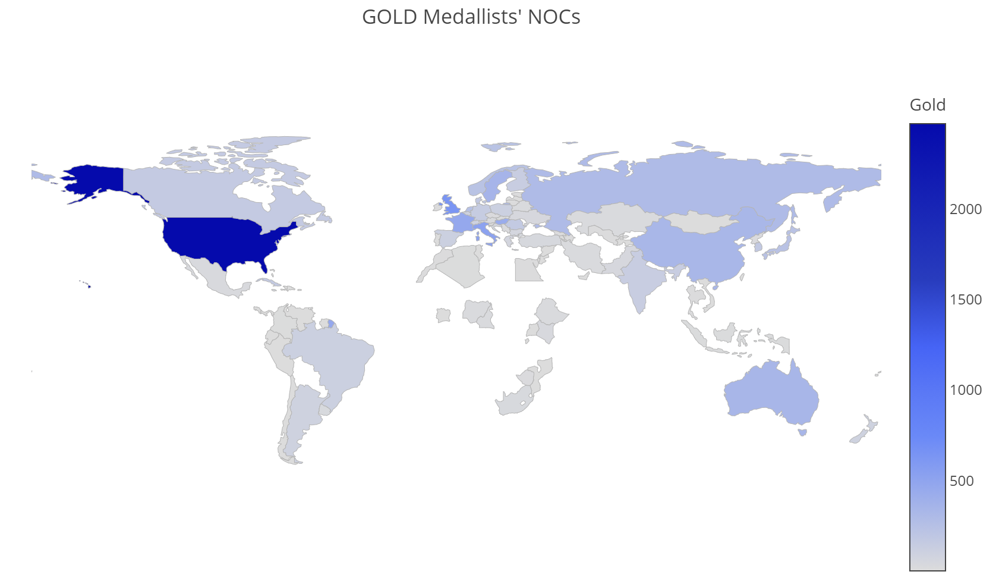
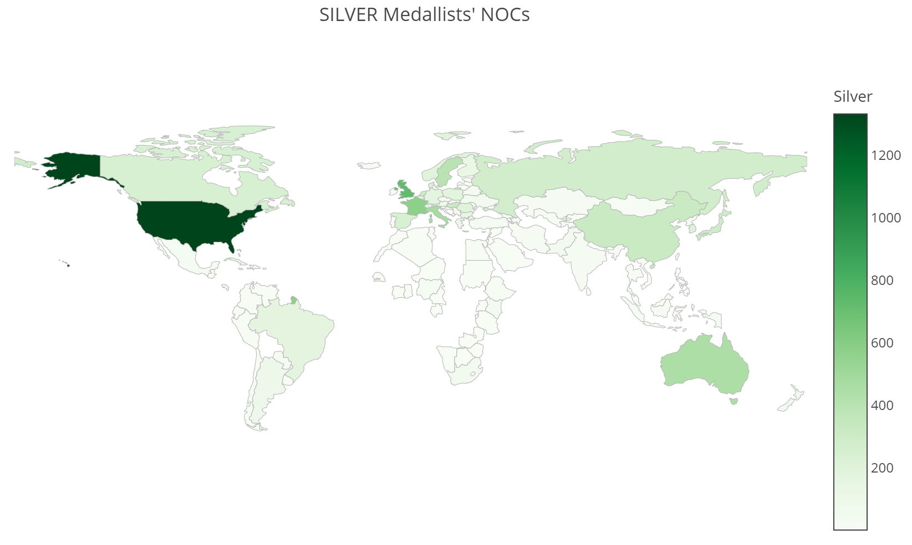
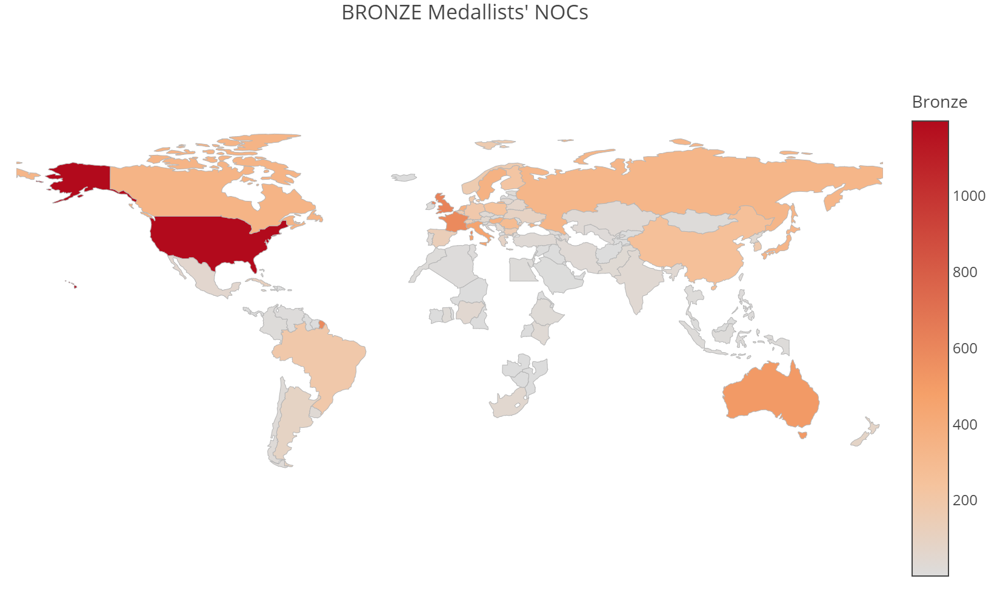

# Olympic Data: Making Olympic Data Speak
In this report, we will analize a dataset that contains the information of all the athletes who competed from Athens 1896 to Rio 2016.

The original dataset is able in: https://www.kaggle.com/heesoo37/120-years-of-olympic-history-athletes-and-results, and this report is based on the SQL-Databricks report found in: https://databricks-prod-cloudfront.cloud.databricks.com/public/4027ec902e239c93eaaa8714f173bcfc/5285432114503862/1710600426655738/7436006275420546/latest.html

In this case we will make general questions, and try to get some interesting information. In the next release, we will dig into sports' specific questions.


```python
###CODE###

#We import the main libraries.
import pandas as pd
import numpy as np
import math
from ipywidgets import interact, interactive, fixed, interact_manual
import ipywidgets as widgets

#Libraries for plotting
import seaborn as sns
import pandas_alive
import matplotlib.pyplot as plt
# set a grey background (use sns.set_theme() if seaborn version 0.11.0 or above) 
sns.set(style="darkgrid")
import plotly.figure_factory as ff
import cufflinks as cf
cf.go_offline()
from plotly.offline import download_plotlyjs, init_notebook_mode, plot, iplot
init_notebook_mode(connected=True)
import plotly.graph_objects as go
import plotly.express as px
from matplotlib import animation, rc
from gapminder import gapminder
pd.options.mode.chained_assignment = None  # default='warn'

#This is to show the graphics and videos.
from IPython.display import display, clear_output, HTML, Image
from numpngw import AnimatedPNGWriter
plt.rcParams['animation.ffmpeg_path'] = r'C:\Users\ignac\AppData\Local\ffmpeg\bin\ffmpeg.exe'

#This is for the race bar-chart
import bar_chart_race as bcr

#We set the Warning Parameter
import warnings
warnings.filterwarnings('ignore')

import pandas as pd
import numpy as np
import math
import matplotlib.pyplot as plt
import seaborn as sns

#import statsmodels.formula.api as sm
from pandas.plotting import scatter_matrix

```


```python
url='https://raw.githubusercontent.com/vascoarizna/JIAF-OlympicAnalysis/main/dataset/athlete_events.csv'

#path1='dataset/athlete_events.csv'
olympicData=pd.read_csv(url)
```

# 1.Exploratory Analysis

## 1.1.Peaking on the Data


```python
#Firstly we take a look on how we see the data.
olympicData.head(3)
```


<div>

<table border="1" class="dataframe">
  <thead>
    <tr style="text-align: right;">
      <th></th>
      <th>ID</th>
      <th>Name</th>
      <th>Sex</th>
      <th>Age</th>
      <th>Height</th>
      <th>Weight</th>
      <th>Team</th>
      <th>NOC</th>
      <th>Games</th>
      <th>Year</th>
      <th>Season</th>
      <th>City</th>
      <th>Sport</th>
      <th>Event</th>
      <th>Medal</th>
    </tr>
  </thead>
  <tbody>
    <tr>
      <th>0</th>
      <td>1</td>
      <td>A Dijiang</td>
      <td>M</td>
      <td>24.0</td>
      <td>180.0</td>
      <td>80.0</td>
      <td>China</td>
      <td>CHN</td>
      <td>1992 Summer</td>
      <td>1992</td>
      <td>Summer</td>
      <td>Barcelona</td>
      <td>Basketball</td>
      <td>Basketball Men's Basketball</td>
      <td>NaN</td>
    </tr>
    <tr>
      <th>1</th>
      <td>2</td>
      <td>A Lamusi</td>
      <td>M</td>
      <td>23.0</td>
      <td>170.0</td>
      <td>60.0</td>
      <td>China</td>
      <td>CHN</td>
      <td>2012 Summer</td>
      <td>2012</td>
      <td>Summer</td>
      <td>London</td>
      <td>Judo</td>
      <td>Judo Men's Extra-Lightweight</td>
      <td>NaN</td>
    </tr>
    <tr>
      <th>2</th>
      <td>3</td>
      <td>Gunnar Nielsen Aaby</td>
      <td>M</td>
      <td>24.0</td>
      <td>NaN</td>
      <td>NaN</td>
      <td>Denmark</td>
      <td>DEN</td>
      <td>1920 Summer</td>
      <td>1920</td>
      <td>Summer</td>
      <td>Antwerpen</td>
      <td>Football</td>
      <td>Football Men's Football</td>
      <td>NaN</td>
    </tr>
  </tbody>
</table>
</div>


## 1.2.Shape of the DataFrame


```python
#Firstly we look for the shape.
olympicData.shape
```


    (271116, 15)


We have 271116 rows and 15 columns

## 1.3.Info of the DataFrame


```python
olympicData.info()
```

    <class 'pandas.core.frame.DataFrame'>
    RangeIndex: 271116 entries, 0 to 271115
    Data columns (total 15 columns):
     #   Column  Non-Null Count   Dtype  
    ---  ------  --------------   -----  
     0   ID      271116 non-null  int64  
     1   Name    271116 non-null  object 
     2   Sex     271116 non-null  object 
     3   Age     261642 non-null  float64
     4   Height  210945 non-null  float64
     5   Weight  208241 non-null  float64
     6   Team    271116 non-null  object 
     7   NOC     271116 non-null  object 
     8   Games   271116 non-null  object 
     9   Year    271116 non-null  int64  
     10  Season  271116 non-null  object 
     11  City    271116 non-null  object 
     12  Sport   271116 non-null  object 
     13  Event   271116 non-null  object 
     14  Medal   39783 non-null   object 
    dtypes: float64(3), int64(2), object(10)
    memory usage: 31.0+ MB
    

We see that the columns have their correspondat data type: ID, Age, height, weight and Year are numerical (integers and floats), and the rest are objects, which makes sense.


## 1.4.Statistical Description of the DataFrame


```python
olympicData.describe()
```


<div>

<table border="1" class="dataframe">
  <thead>
    <tr style="text-align: right;">
      <th></th>
      <th>ID</th>
      <th>Age</th>
      <th>Height</th>
      <th>Weight</th>
      <th>Year</th>
    </tr>
  </thead>
  <tbody>
    <tr>
      <th>count</th>
      <td>271116.000000</td>
      <td>261642.000000</td>
      <td>210945.000000</td>
      <td>208241.000000</td>
      <td>271116.000000</td>
    </tr>
    <tr>
      <th>mean</th>
      <td>68248.954396</td>
      <td>25.556898</td>
      <td>175.338970</td>
      <td>70.702393</td>
      <td>1978.378480</td>
    </tr>
    <tr>
      <th>std</th>
      <td>39022.286345</td>
      <td>6.393561</td>
      <td>10.518462</td>
      <td>14.348020</td>
      <td>29.877632</td>
    </tr>
    <tr>
      <th>min</th>
      <td>1.000000</td>
      <td>10.000000</td>
      <td>127.000000</td>
      <td>25.000000</td>
      <td>1896.000000</td>
    </tr>
    <tr>
      <th>25%</th>
      <td>34643.000000</td>
      <td>21.000000</td>
      <td>168.000000</td>
      <td>60.000000</td>
      <td>1960.000000</td>
    </tr>
    <tr>
      <th>50%</th>
      <td>68205.000000</td>
      <td>24.000000</td>
      <td>175.000000</td>
      <td>70.000000</td>
      <td>1988.000000</td>
    </tr>
    <tr>
      <th>75%</th>
      <td>102097.250000</td>
      <td>28.000000</td>
      <td>183.000000</td>
      <td>79.000000</td>
      <td>2002.000000</td>
    </tr>
    <tr>
      <th>max</th>
      <td>135571.000000</td>
      <td>97.000000</td>
      <td>226.000000</td>
      <td>214.000000</td>
      <td>2016.000000</td>
    </tr>
  </tbody>
</table>
</div>


# 2.Data Preparation/Cleaning

## 2.1.Missing Values


```python
# Check to see if there are any missing values in our data set
olympicData.isnull().any().sort_values(ascending=False).head(5)
```


    Age        True
    Height     True
    Weight     True
    Medal      True
    ID        False
    dtype: bool


```python
#checking for null values
print("Sum of NULL values in each column. ")
nullSum=(olympicData).isnull().sum()
nullSum.sort_values(ascending=False).head(5)
```

    Sum of NULL values in each column. 
    Medal     231333
    Weight     62875
    Height     60171
    Age         9474
    ID             0
    dtype: int64


```python
ratio=nullSum/olympicData.shape[0]
ratio.sort_values(ascending=False).head(5)
```


    Medal     0.853262
    Weight    0.231912
    Height    0.221938
    Age       0.034944
    ID        0.000000
    dtype: float64


Missing Data Summary:
- Age: 3.5% of the data has the age missing
- Height: 22.1% of the data has the Height Missing
- Weigh: 23.1% of the values are missing
- Medal: 85.3% of the values are missing


```python
olympicData.groupby('Medal').ID.count()
```


    Medal
    Bronze    13295
    Gold      13372
    Silver    13116
    Name: ID, dtype: int64


For ML purposes we should impute values or drop the rows.
Each column should be treated in a different way:
- For the case of Age, Height and Weight, the data imputation (mean, in this case) should be of the athlete's sports+event average, rather than from the DataFrame's total average. Why? Because usually, for the same events (for example: Inside the Sports Boxing, the event/category up to 75kg) the atheltes tend to have the same body structure.

In the case of the medals, althought there is no reference, we asumme that all the NaNs correspond to athletes who never who any medal.
That is why, we should LabelEncode these category into:
- 0 for NaN
- 1 for Bronze
- 2 for Silver
- 3 for Gold.

This way we would, not only get rid of the NULL values, but also we will have our dataset already prepare for Fitting it into a ML Model.

### 2.2.1. Medal Imputation/Label Encoder


```python
#As we want to have a certain order, we will map manually

olympicData['MedalNumeric']=0
olympicData.loc[olympicData['Medal']=='Bronze','MedalNumeric']=1
olympicData.loc[olympicData['Medal']=='Silver','MedalNumeric']=2
olympicData.loc[olympicData['Medal']=='Gold','MedalNumeric']=3
```

### 2.2.1. Age, Height and Weight Imputation

We will do the imputation following the events


```python
ageMeanEvent=olympicData.groupby('Event').Age.mean()
heightMeanEvent=olympicData.groupby('Event').Height.mean()
weightMeanEvent=olympicData.groupby('Event').Weight.mean()

ageMeanEventDic=ageMeanEvent.to_dict()
heightMeanEventDic=heightMeanEvent.to_dict()
weightMeanEventDic=weightMeanEvent.to_dict()

ageNA=olympicData['Age'].isna()
heightNA=olympicData['Height'].isna()
weightNA=olympicData['Weight'].isna()

olympicData['Height1'] = olympicData.loc[heightNA,'Event'].map(heightMeanEventDic)
olympicData['Weight1'] = olympicData.loc[weightNA,'Event'].map(weightMeanEventDic)
olympicData['Age1'] = olympicData.loc[ageNA,'Event'].map(ageMeanEventDic)


heightNotNA=olympicData['Height1'].isna()
weightNotNA=olympicData['Weight1'].isna()
ageNotNA=olympicData['Age1'].isna()
```


```python
#I assign the non-null values that we held in Height 1 to the Null values we have in Heigh
olympicData.loc[heightNA,'Height']=olympicData.loc[~heightNotNA,'Height1']

#I assign the non-null values that we held in Height 1 to the Null values we have in Heigh
olympicData.loc[weightNA,'Weight']=olympicData.loc[~weightNotNA,'Weight1']

#I assign the non-null values that we held in Height 1 to the Null values we have in Heigh
olympicData.loc[ageNA,'Age']=olympicData.loc[~ageNotNA,'Age1']
```


```python
#checking for null values
print("Sum of NULL values in each column. ")
nullSum=(olympicData).isnull().sum()
nullSum.sort_values(ascending=False).head(5)
```

    Sum of NULL values in each column. 
    Age1       261784
    Medal      231333
    Height1    213028
    Weight1    212901
    Weight       4660
    dtype: int64


```python
ratio=nullSum/olympicData.shape[0]
ratio.sort_values(ascending=False).head(6)
```


    Age1       0.965579
    Medal      0.853262
    Height1    0.785745
    Weight1    0.785276
    Weight     0.017188
    Height     0.007683
    dtype: float64


Now we will do the imputation following the sports' average


```python
ageMeanSport=olympicData.groupby('Sport').Age.mean()
heightMeanSport=olympicData.groupby('Sport').Height.mean()
weightMeanSport=olympicData.groupby('Sport').Weight.mean()

ageMeanSportDic=ageMeanSport.to_dict()
heightMeanSportDic=heightMeanSport.to_dict()
weightMeanSportDic=weightMeanSport.to_dict()

ageNA=olympicData['Age'].isna()
heightNA=olympicData['Height'].isna()
weightNA=olympicData['Weight'].isna()

olympicData['Height1'] = olympicData.loc[heightNA,'Sport'].map(heightMeanSportDic)
olympicData['Weight1'] = olympicData.loc[weightNA,'Sport'].map(weightMeanSportDic)
olympicData['Age1'] = olympicData.loc[ageNA,'Sport'].map(ageMeanSportDic)


heightNotNA=olympicData['Height1'].isna()
weightNotNA=olympicData['Weight1'].isna()
ageNotNA=olympicData['Age1'].isna()
```


```python
#I assign the non-null values that we held in Height 1 to the Null values we have in Heigh
olympicData.loc[heightNA,'Height']=olympicData.loc[~heightNotNA,'Height1']

#I assign the non-null values that we held in Height 1 to the Null values we have in Heigh
olympicData.loc[weightNA,'Weight']=olympicData.loc[~weightNotNA,'Weight1']

#I assign the non-null values that we held in Height 1 to the Null values we have in Heigh
olympicData.loc[ageNA,'Age']=olympicData.loc[~ageNotNA,'Age1']
```


```python
#We delete these temporary columns
olympicData=olympicData.drop(columns=['Age1','Weight1','Height1'])
#olympicData=olympicData.drop(columns=['Medal']) #We will keep 'Medal' as categorical, as in this case we won't apply any ML model.
# # We will also keep MedalNumerical.

```


```python
#checking for null values
print("Sum of NULL values in each column. ")
nullSum=(olympicData).isnull().sum()
nullSum.sort_values(ascending=False).head(5)
```

    Sum of NULL values in each column. 
    Medal     231333
    Weight       217
    Height        99
    ID             0
    Name           0
    dtype: int64


```python
ratio=nullSum/olympicData.shape[0]
ratio.sort_values(ascending=False).head(5)
```


    Medal     0.853262
    Weight    0.000800
    Height    0.000365
    ID        0.000000
    Name      0.000000
    dtype: float64


```python
# Replace NaNs in columns with the
# mean of values in the same column
olympicData['Age'].fillna(value=olympicData['Age'].mean(), inplace=True)
olympicData['Height'].fillna(value=olympicData['Height'].mean(), inplace=True)
olympicData['Weight'].fillna(value=olympicData['Weight'].mean(), inplace=True)
```


```python
#checking for null values
print("Sum of NULL values in each column. ")
nullSum=(olympicData).isnull().sum()
nullSum.sort_values(ascending=False).head(5)
```

    Sum of NULL values in each column. 
    Medal    231333
    ID            0
    Name          0
    Sex           0
    Age           0
    dtype: int64


## ISO Codes
The NOC codes not compatiable to ISO 3166-1 alpha-3 standard. And the ISO codes are the one we must use for interactive plotting purposes.


```python
codeMapping = pd.read_excel('dataset/codesMapping.xls', sheet_name = 'mapping')
codeMapping=codeMapping.reset_index()
olympicDataISO =(olympicData.merge(codeMapping, left_on='NOC', right_on='IOC'))
olympicDataISO.drop(columns=['index','IOC'],inplace=True)
```

## Continent Codes


```python
#We will also merge with the regions (continents)
```


```python
continent=pd.read_csv('https://raw.githubusercontent.com/lukes/ISO-3166-Countries-with-Regional-Codes/master/all/all.csv')
```


```python
continent=continent.reset_index()
olympicDataISO =(olympicDataISO.merge(continent, left_on='ISO', right_on='alpha-3'))
olympicDataISO.drop(columns=['index','name','alpha-2','alpha-3','country-code','iso_3166-2','intermediate-region','region-code','sub-region-code','intermediate-region-code'],inplace=True)
olympicDataISO.rename(columns={'region':'Continent'},inplace=True)
```

## Season Filtering
In this report we will only analyzing Summer Games


```python
olympicDataISO=olympicDataISO[olympicDataISO.Season=='Summer']
```

---

<br>

# Queries


# Age Distribution of Participants


```python
totalAgeDistribution=olympicDataISO.groupby('Age')[['Medal']].count()
totalAgeDistribution.head(5)
```


<div>

<table border="1" class="dataframe">
  <thead>
    <tr style="text-align: right;">
      <th></th>
      <th>Medal</th>
    </tr>
    <tr>
      <th>Age</th>
      <th></th>
    </tr>
  </thead>
  <tbody>
    <tr>
      <th>10.0</th>
      <td>1</td>
    </tr>
    <tr>
      <th>11.0</th>
      <td>1</td>
    </tr>
    <tr>
      <th>12.0</th>
      <td>6</td>
    </tr>
    <tr>
      <th>13.0</th>
      <td>12</td>
    </tr>
    <tr>
      <th>14.0</th>
      <td>68</td>
    </tr>
  </tbody>
</table>
</div>


```python
totalAgeDistribution.tail(5)
```


<div>

<table border="1" class="dataframe">
  <thead>
    <tr style="text-align: right;">
      <th></th>
      <th>Medal</th>
    </tr>
    <tr>
      <th>Age</th>
      <th></th>
    </tr>
  </thead>
  <tbody>
    <tr>
      <th>81.0</th>
      <td>0</td>
    </tr>
    <tr>
      <th>84.0</th>
      <td>0</td>
    </tr>
    <tr>
      <th>88.0</th>
      <td>0</td>
    </tr>
    <tr>
      <th>96.0</th>
      <td>0</td>
    </tr>
    <tr>
      <th>97.0</th>
      <td>0</td>
    </tr>
  </tbody>
</table>
</div>


It's interesting to see the youngest and oldest Olympians.


## Youngest Olympic


```python
# Youngest Olympian (who is also the youngest medalist)
olympicDataISO[olympicDataISO.Age==totalAgeDistribution.reset_index().Age.min()]
```


<div>

<table border="1" class="dataframe">
  <thead>
    <tr style="text-align: right;">
      <th></th>
      <th>ID</th>
      <th>Name</th>
      <th>Sex</th>
      <th>Age</th>
      <th>Height</th>
      <th>Weight</th>
      <th>Team</th>
      <th>NOC</th>
      <th>Games</th>
      <th>Year</th>
      <th>Season</th>
      <th>City</th>
      <th>Sport</th>
      <th>Event</th>
      <th>Medal</th>
      <th>MedalNumeric</th>
      <th>Country</th>
      <th>ISO</th>
      <th>Continent</th>
      <th>sub-region</th>
    </tr>
  </thead>
  <tbody>
    <tr>
      <th>99108</th>
      <td>71691</td>
      <td>Dimitrios Loundras</td>
      <td>M</td>
      <td>10.0</td>
      <td>159.0</td>
      <td>66.0</td>
      <td>Ethnikos Gymnastikos Syllogos</td>
      <td>GRE</td>
      <td>1896 Summer</td>
      <td>1896</td>
      <td>Summer</td>
      <td>Athina</td>
      <td>Gymnastics</td>
      <td>Gymnastics Men's Parallel Bars, Teams</td>
      <td>Bronze</td>
      <td>1</td>
      <td>Greece</td>
      <td>GRC</td>
      <td>Europe</td>
      <td>Southern Europe</td>
    </tr>
  </tbody>
</table>
</div>


Dimitrios Loundras (6 September 1885 – 15 February 1970) was a Greek gymnast and naval officer who competed at the 1896 Summer Olympics in Athens. He was the last surviving participant of these Games.

Loundras competed in the team beams event. In that competition, Loundras was a member of the Ethnikos Gymnastikos Syllogos team that placed sixty-ninth of the sixty teams in the event, giving him a bronze medal. At 10 years 218 days he remains the youngest medalist and competitor in Olympic history.

<i>(extracted from: https://en.wikipedia.org/wiki/Dimitrios_Loundras)</i>


## Oldest Olympian


```python
#Oldest Olympian
olympicDataISO[olympicDataISO.Age==totalAgeDistribution.reset_index().Age.max()]
```


<div>

<table border="1" class="dataframe">
  <thead>
    <tr style="text-align: right;">
      <th></th>
      <th>ID</th>
      <th>Name</th>
      <th>Sex</th>
      <th>Age</th>
      <th>Height</th>
      <th>Weight</th>
      <th>Team</th>
      <th>NOC</th>
      <th>Games</th>
      <th>Year</th>
      <th>Season</th>
      <th>City</th>
      <th>Sport</th>
      <th>Event</th>
      <th>Medal</th>
      <th>MedalNumeric</th>
      <th>Country</th>
      <th>ISO</th>
      <th>Continent</th>
      <th>sub-region</th>
    </tr>
  </thead>
  <tbody>
    <tr>
      <th>32196</th>
      <td>128719</td>
      <td>John Quincy Adams Ward</td>
      <td>M</td>
      <td>97.0</td>
      <td>173.369803</td>
      <td>76.0</td>
      <td>United States</td>
      <td>USA</td>
      <td>1928 Summer</td>
      <td>1928</td>
      <td>Summer</td>
      <td>Amsterdam</td>
      <td>Art Competitions</td>
      <td>Art Competitions Mixed Sculpturing, Statues</td>
      <td>NaN</td>
      <td>0</td>
      <td>United States</td>
      <td>USA</td>
      <td>Americas</td>
      <td>Northern America</td>
    </tr>
  </tbody>
</table>
</div>


John Quincy Adams Ward (June 29, 1830 – May 1, 1910) was an American sculptor, whose most familiar work is his larger than life-size standing statue of George Washington on the steps of Federal Hall National Memorial in New York City.

His work was part of the sculpture event in the art competition at the 1928 Summer Olympics.

<i>(extracted from: https://en.wikipedia.org/wiki/John_Quincy_Adams_Ward)</i>


<br>

## Age Distribution in the Olympic History


```python
sns.histplot(data=totalAgeDistribution, x="Age", kde=True)
plt.show()
```


    

    


```python
totalAgeDistributionGold=olympicDataISO[olympicDataISO.Medal=='Gold'].groupby('Age')[['Medal']].count()
totalAgeDistributionGold
```


<div>

<table border="1" class="dataframe">
  <thead>
    <tr style="text-align: right;">
      <th></th>
      <th>Medal</th>
    </tr>
    <tr>
      <th>Age</th>
      <th></th>
    </tr>
  </thead>
  <tbody>
    <tr>
      <th>13.0</th>
      <td>6</td>
    </tr>
    <tr>
      <th>14.0</th>
      <td>24</td>
    </tr>
    <tr>
      <th>15.0</th>
      <td>50</td>
    </tr>
    <tr>
      <th>16.0</th>
      <td>92</td>
    </tr>
    <tr>
      <th>17.0</th>
      <td>155</td>
    </tr>
    <tr>
      <th>...</th>
      <td>...</td>
    </tr>
    <tr>
      <th>58.0</th>
      <td>3</td>
    </tr>
    <tr>
      <th>59.0</th>
      <td>2</td>
    </tr>
    <tr>
      <th>60.0</th>
      <td>4</td>
    </tr>
    <tr>
      <th>63.0</th>
      <td>4</td>
    </tr>
    <tr>
      <th>64.0</th>
      <td>2</td>
    </tr>
  </tbody>
</table>
<p>102 rows × 1 columns</p>
</div>


## Gold Medalist Age Distribution in the Olympic History


```python
sns.histplot(data=totalAgeDistributionGold, x="Age", kde=True)
```


    <AxesSubplot:xlabel='Age', ylabel='Count'>


    

    


# Gold Medals for Athletes Over 50 based on Sports


Select count(Sport),Sport from athlete_events_final_vik where Age > 50 and Medal='Gold' group by Sport


```python
goldMedalistOver50=olympicDataISO[(olympicDataISO.Age>50)&(olympicDataISO.Medal=='Gold')].groupby('Sport')[['Medal']].count()
goldMedalistOver50
```


<div>

<table border="1" class="dataframe">
  <thead>
    <tr style="text-align: right;">
      <th></th>
      <th>Medal</th>
    </tr>
    <tr>
      <th>Sport</th>
      <th></th>
    </tr>
  </thead>
  <tbody>
    <tr>
      <th>Archery</th>
      <td>12</td>
    </tr>
    <tr>
      <th>Art Competitions</th>
      <td>8</td>
    </tr>
    <tr>
      <th>Croquet</th>
      <td>1</td>
    </tr>
    <tr>
      <th>Equestrianism</th>
      <td>18</td>
    </tr>
    <tr>
      <th>Roque</th>
      <td>1</td>
    </tr>
    <tr>
      <th>Sailing</th>
      <td>12</td>
    </tr>
    <tr>
      <th>Shooting</th>
      <td>11</td>
    </tr>
  </tbody>
</table>
</div>


```python
plt.figure(figsize=(12,6))
ax = sns.barplot( x="Sport",
                    y='Medal',
                    #hue="Sex", 
                    data=goldMedalistOver50.reset_index())
plt.xticks(rotation=90)
plt.show()
```


    

    

<br>


# Gender equality over the Olympic Games


```python
gendercount=olympicDataISO.groupby(['Sex','Year'])[['ID']].count().reset_index()
gendercount.rename(columns={'ID':'count'},inplace=True)
gendercount.head(5)
```


<div>

<table border="1" class="dataframe">
  <thead>
    <tr style="text-align: right;">
      <th></th>
      <th>Sex</th>
      <th>Year</th>
      <th>count</th>
    </tr>
  </thead>
  <tbody>
    <tr>
      <th>0</th>
      <td>F</td>
      <td>1900</td>
      <td>31</td>
    </tr>
    <tr>
      <th>1</th>
      <td>F</td>
      <td>1904</td>
      <td>16</td>
    </tr>
    <tr>
      <th>2</th>
      <td>F</td>
      <td>1906</td>
      <td>11</td>
    </tr>
    <tr>
      <th>3</th>
      <td>F</td>
      <td>1908</td>
      <td>47</td>
    </tr>
    <tr>
      <th>4</th>
      <td>F</td>
      <td>1912</td>
      <td>85</td>
    </tr>
  </tbody>
</table>
</div>


```python
plt.figure(figsize=(12,6))
ax = sns.countplot(x="Year", hue="Sex", data=olympicDataISO)
plt.xticks(rotation=90)
plt.show()
```


    

    


```python
plt.figure(figsize=(12,6))
sns.lineplot(data=gendercount,x="Year", y='count', hue="Sex", markers= ["o","<"])
plt.xticks(rotation=90)
plt.show()
```


    

    

<br>


# Women medals per edition of the Games


```python
medalsPerGenderOverYears=olympicDataISO.groupby(['Year','Sex'])[['MedalNumeric']].sum()
medalsPerGenderOverYears.head(10)
```


<div>

<table border="1" class="dataframe">
  <thead>
    <tr style="text-align: right;">
      <th></th>
      <th></th>
      <th>MedalNumeric</th>
    </tr>
    <tr>
      <th>Year</th>
      <th>Sex</th>
      <th></th>
    </tr>
  </thead>
  <tbody>
    <tr>
      <th>1896</th>
      <th>M</th>
      <td>310</td>
    </tr>
    <tr>
      <th rowspan="2" valign="top">1900</th>
      <th>F</th>
      <td>23</td>
    </tr>
    <tr>
      <th>M</th>
      <td>1207</td>
    </tr>
    <tr>
      <th rowspan="2" valign="top">1904</th>
      <th>F</th>
      <td>24</td>
    </tr>
    <tr>
      <th>M</th>
      <td>971</td>
    </tr>
    <tr>
      <th rowspan="2" valign="top">1906</th>
      <th>F</th>
      <td>12</td>
    </tr>
    <tr>
      <th>M</th>
      <td>913</td>
    </tr>
    <tr>
      <th rowspan="2" valign="top">1908</th>
      <th>F</th>
      <td>33</td>
    </tr>
    <tr>
      <th>M</th>
      <td>1610</td>
    </tr>
    <tr>
      <th>1912</th>
      <th>F</th>
      <td>55</td>
    </tr>
  </tbody>
</table>
</div>


```python
plt.figure(figsize=(12,6))
ax = sns.lineplot(data=medalsPerGenderOverYears.reset_index(),x="Year", y='MedalNumeric', hue="Sex", markers= ["o","<"])
plt.xticks(rotation=90)
plt.show()
```


    

    


<br>


# Top 10 Gold Medal Countries


```python
top10 = olympicDataISO[olympicDataISO.Medal=='Gold'].groupby('NOC')[['MedalNumeric']].\
sum().sort_values('MedalNumeric',ascending=False).head(10)
top10
```


<div>

<table border="1" class="dataframe">
  <thead>
    <tr style="text-align: right;">
      <th></th>
      <th>MedalNumeric</th>
    </tr>
    <tr>
      <th>NOC</th>
      <th></th>
    </tr>
  </thead>
  <tbody>
    <tr>
      <th>USA</th>
      <td>7416</td>
    </tr>
    <tr>
      <th>GBR</th>
      <td>1908</td>
    </tr>
    <tr>
      <th>GER</th>
      <td>1776</td>
    </tr>
    <tr>
      <th>ITA</th>
      <td>1554</td>
    </tr>
    <tr>
      <th>FRA</th>
      <td>1395</td>
    </tr>
    <tr>
      <th>HUN</th>
      <td>1296</td>
    </tr>
    <tr>
      <th>SWE</th>
      <td>1062</td>
    </tr>
    <tr>
      <th>AUS</th>
      <td>1026</td>
    </tr>
    <tr>
      <th>CHN</th>
      <td>1002</td>
    </tr>
    <tr>
      <th>RUS</th>
      <td>888</td>
    </tr>
  </tbody>
</table>
</div>


```python
plt.figure(figsize=(12,6))
ax = sns.barplot( x="NOC",
                    y='MedalNumeric',
                    #hue="Sex", 
                    data=top10.reset_index())
plt.xticks(rotation=90)
plt.show()
```


    

    


<br>


# Disciplines with the greatest number of Gold Medals


```python
topDisciplines=olympicDataISO[olympicDataISO.Medal=='Gold'].groupby('Event')[['Medal']].count().sort_values('Medal',ascending=False)
topDisciplines=topDisciplines.head(10)
topDisciplines
```


<div>

<table border="1" class="dataframe">
  <thead>
    <tr style="text-align: right;">
      <th></th>
      <th>Medal</th>
    </tr>
    <tr>
      <th>Event</th>
      <th></th>
    </tr>
  </thead>
  <tbody>
    <tr>
      <th>Hockey Men's Hockey</th>
      <td>360</td>
    </tr>
    <tr>
      <th>Football Men's Football</th>
      <td>329</td>
    </tr>
    <tr>
      <th>Water Polo Men's Water Polo</th>
      <td>228</td>
    </tr>
    <tr>
      <th>Rowing Men's Coxed Eights</th>
      <td>226</td>
    </tr>
    <tr>
      <th>Gymnastics Men's Team All-Around</th>
      <td>217</td>
    </tr>
    <tr>
      <th>Basketball Men's Basketball</th>
      <td>198</td>
    </tr>
    <tr>
      <th>Hockey Women's Hockey</th>
      <td>158</td>
    </tr>
    <tr>
      <th>Swimming Men's 4 x 200 metres Freestyle Relay</th>
      <td>136</td>
    </tr>
    <tr>
      <th>Fencing Men's epee, Team</th>
      <td>134</td>
    </tr>
    <tr>
      <th>Swimming Women's 4 x 100 metres Freestyle Relay</th>
      <td>120</td>
    </tr>
  </tbody>
</table>
</div>


```python
plt.figure(figsize=(12,6))
ax = sns.barplot( x="Medal",
                    y='Event',
                    #hue="Sex", 
                    #orient='h',
                    data=topDisciplines.reset_index())
plt.xticks(rotation=90)
plt.show()
```


    

    


<br>


# Height vs Weight of Olympic Gold Medalists


```python
WeightVsHeight = olympicDataISO[olympicDataISO.Medal=='Gold'][['Weight','Height','Sex']]
sns.scatterplot(data=WeightVsHeight, x="Height", y="Weight",hue='Sex',alpha=0.5)
plt.title('Height vs Weight vs Gender')
plt.show()
```


    

    


# Variation of Age for Male Athletes over time


```python
maleAgeVar=olympicDataISO[olympicDataISO.Sex=='M'].groupby('Year')[['Age']].agg([min,np.mean,np.median,max])
maleAgeVar=maleAgeVar.Age
maleAgeVar.head()
```


<div>

<table border="1" class="dataframe">
  <thead>
    <tr style="text-align: right;">
      <th></th>
      <th>min</th>
      <th>mean</th>
      <th>median</th>
      <th>max</th>
    </tr>
    <tr>
      <th>Year</th>
      <th></th>
      <th></th>
      <th></th>
      <th></th>
    </tr>
  </thead>
  <tbody>
    <tr>
      <th>1896</th>
      <td>10.0</td>
      <td>25.004807</td>
      <td>24.649695</td>
      <td>40.0</td>
    </tr>
    <tr>
      <th>1900</th>
      <td>15.0</td>
      <td>29.043367</td>
      <td>27.788415</td>
      <td>71.0</td>
    </tr>
    <tr>
      <th>1904</th>
      <td>14.0</td>
      <td>26.361537</td>
      <td>24.887500</td>
      <td>71.0</td>
    </tr>
    <tr>
      <th>1906</th>
      <td>13.0</td>
      <td>27.098638</td>
      <td>25.187500</td>
      <td>54.0</td>
    </tr>
    <tr>
      <th>1908</th>
      <td>14.0</td>
      <td>27.037845</td>
      <td>25.000000</td>
      <td>61.0</td>
    </tr>
  </tbody>
</table>
</div>


```python
plt.figure(figsize=(12,6))
sns.lineplot(data=maleAgeVar,x=maleAgeVar.index, y='max', markers= ["o","<"],label='max')
sns.lineplot(data=maleAgeVar,x=maleAgeVar.index, y='median', markers= ["o","<"],label='median')
sns.lineplot(data=maleAgeVar,x=maleAgeVar.index, y='mean', markers= ["o","<"],label='mean')
sns.lineplot(data=maleAgeVar,x=maleAgeVar.index, y='min', markers= ["o","<"],label='min')
plt.xticks(rotation=90)
plt.title("Men's Age Variation through the Olympic Games")
plt.ylabel('Variation')
plt.show()
```


    

    


<br>


# Variation of Age for Female Athletes over time


```python
femaleAgeVar=olympicDataISO[olympicDataISO.Sex=='F'].groupby('Year')[['Age']].agg([min,np.mean,np.median,max])
femaleAgeVar=femaleAgeVar.Age
femaleAgeVar.head()
```


<div>

<table border="1" class="dataframe">
  <thead>
    <tr style="text-align: right;">
      <th></th>
      <th>min</th>
      <th>mean</th>
      <th>median</th>
      <th>max</th>
    </tr>
    <tr>
      <th>Year</th>
      <th></th>
      <th></th>
      <th></th>
      <th></th>
    </tr>
  </thead>
  <tbody>
    <tr>
      <th>1900</th>
      <td>13.000000</td>
      <td>30.010635</td>
      <td>29.038462</td>
      <td>46.000000</td>
    </tr>
    <tr>
      <th>1904</th>
      <td>24.000000</td>
      <td>49.909375</td>
      <td>55.000000</td>
      <td>63.000000</td>
    </tr>
    <tr>
      <th>1906</th>
      <td>21.000000</td>
      <td>25.234819</td>
      <td>24.116906</td>
      <td>29.038462</td>
    </tr>
    <tr>
      <th>1908</th>
      <td>19.414545</td>
      <td>34.642863</td>
      <td>36.000000</td>
      <td>54.000000</td>
    </tr>
    <tr>
      <th>1912</th>
      <td>13.000000</td>
      <td>22.411765</td>
      <td>21.000000</td>
      <td>45.000000</td>
    </tr>
  </tbody>
</table>
</div>


```python
plt.figure(figsize=(12,6))
sns.lineplot(data=femaleAgeVar,x=femaleAgeVar.index, y='max', markers= ["o","<"],label='max')
sns.lineplot(data=femaleAgeVar,x=femaleAgeVar.index, y='median', markers= ["o","<"],label='median')

sns.lineplot(data=femaleAgeVar,x=femaleAgeVar.index, y='mean', markers= ["o","<"],label='mean')
sns.lineplot(data=femaleAgeVar,x=femaleAgeVar.index, y='min', markers= ["o","<"],label='min')

plt.xticks(rotation=90)
plt.title("Women's Age Variation through the Olympic Games")
plt.ylabel('Variation')
plt.show()
```


    

    


<br>


# Variation of Weight for Male Athletes over time


```python
maleWeightVar=olympicDataISO[olympicDataISO.Sex=='M'].groupby('Year')[['Weight']].agg([min,np.mean,np.median,max])
maleWeightVar=maleWeightVar.Weight
maleWeightVar.head()
```


<div>

<table border="1" class="dataframe">
  <thead>
    <tr style="text-align: right;">
      <th></th>
      <th>min</th>
      <th>mean</th>
      <th>median</th>
      <th>max</th>
    </tr>
    <tr>
      <th>Year</th>
      <th></th>
      <th></th>
      <th></th>
      <th></th>
    </tr>
  </thead>
  <tbody>
    <tr>
      <th>1896</th>
      <td>45.0</td>
      <td>72.364564</td>
      <td>70.963234</td>
      <td>115.269896</td>
    </tr>
    <tr>
      <th>1900</th>
      <td>51.0</td>
      <td>75.681802</td>
      <td>76.173007</td>
      <td>115.269896</td>
    </tr>
    <tr>
      <th>1904</th>
      <td>43.0</td>
      <td>72.032654</td>
      <td>69.970678</td>
      <td>115.269896</td>
    </tr>
    <tr>
      <th>1906</th>
      <td>52.0</td>
      <td>75.583481</td>
      <td>75.778938</td>
      <td>115.269896</td>
    </tr>
    <tr>
      <th>1908</th>
      <td>51.0</td>
      <td>73.867432</td>
      <td>74.000000</td>
      <td>115.269896</td>
    </tr>
  </tbody>
</table>
</div>


```python
plt.figure(figsize=(12,6))
sns.lineplot(data=maleWeightVar,x=maleWeightVar.index, y='max', markers= ["o","<"],label='max')

sns.lineplot(data=maleWeightVar,x=maleWeightVar.index, y='median', markers= ["o","<"],label='median')
sns.lineplot(data=maleWeightVar,x=maleWeightVar.index, y='mean', markers= ["o","<"],label='mean')

sns.lineplot(data=maleWeightVar,x=maleWeightVar.index, y='min', markers= ["o","<"],label='min')

plt.xticks(rotation=90)
plt.title("Men's Weight Variation through the Olympic Games")
plt.ylabel('Variation')

plt.show()
```


    

    


<br>


# Variation of Weight for Female Athletes over time
select min(Weight),mean(Weight), max(Weight), Year from athlete_events_final_vik where Sex = 'F' and Year > 1925 group by Year order by Year asc; 


```python
womenWeightVar=olympicDataISO[olympicDataISO.Sex=='F'].groupby('Year')[['Weight']].agg([min,np.mean,np.median,max])
womenWeightVar=womenWeightVar.Weight
womenWeightVar.head()
```


<div>

<table border="1" class="dataframe">
  <thead>
    <tr style="text-align: right;">
      <th></th>
      <th>min</th>
      <th>mean</th>
      <th>median</th>
      <th>max</th>
    </tr>
    <tr>
      <th>Year</th>
      <th></th>
      <th></th>
      <th></th>
      <th></th>
    </tr>
  </thead>
  <tbody>
    <tr>
      <th>1900</th>
      <td>61.979466</td>
      <td>67.837673</td>
      <td>67.648002</td>
      <td>76.509324</td>
    </tr>
    <tr>
      <th>1904</th>
      <td>69.970678</td>
      <td>69.970678</td>
      <td>69.970678</td>
      <td>69.970678</td>
    </tr>
    <tr>
      <th>1906</th>
      <td>61.979466</td>
      <td>67.169175</td>
      <td>61.979466</td>
      <td>73.396825</td>
    </tr>
    <tr>
      <th>1908</th>
      <td>51.119403</td>
      <td>67.111217</td>
      <td>69.970678</td>
      <td>77.000000</td>
    </tr>
    <tr>
      <th>1912</th>
      <td>61.674173</td>
      <td>64.688523</td>
      <td>61.979466</td>
      <td>73.396825</td>
    </tr>
  </tbody>
</table>
</div>


```python
plt.figure(figsize=(12,6))
sns.lineplot(data=womenWeightVar,x=womenWeightVar.index, y='max', markers= ["o","<"],label='max')
sns.lineplot(data=womenWeightVar,x=womenWeightVar.index, y='median', markers= ["o","<"],label='median')

sns.lineplot(data=womenWeightVar,x=womenWeightVar.index, y='mean', markers= ["o","<"],label='mean')
sns.lineplot(data=womenWeightVar,x=womenWeightVar.index, y='min', markers= ["o","<"],label='min')

plt.xticks(rotation=90)
plt.title("Women's Weight Variation through the Olympic Games")
plt.ylabel('Variation')
plt.show()
```


    

    


<br>


# Variation of Height for Male Athletes over time
select min(Height),mean(Height), max(Height), Year from athlete_events_final_vik where Sex = 'M' group by Year order by Year asc; 


```python
maleHeightVar=olympicDataISO[olympicDataISO.Sex=='M'].groupby('Year')[['Height']].agg([min,np.mean,np.median,max])
maleHeightVar=maleHeightVar.Height
maleHeightVar.head()
```


<div>

<table border="1" class="dataframe">
  <thead>
    <tr style="text-align: right;">
      <th></th>
      <th>min</th>
      <th>mean</th>
      <th>median</th>
      <th>max</th>
    </tr>
    <tr>
      <th>Year</th>
      <th></th>
      <th></th>
      <th></th>
      <th></th>
    </tr>
  </thead>
  <tbody>
    <tr>
      <th>1896</th>
      <td>154.0</td>
      <td>174.524546</td>
      <td>173.937657</td>
      <td>190.640466</td>
    </tr>
    <tr>
      <th>1900</th>
      <td>153.0</td>
      <td>177.241113</td>
      <td>178.345624</td>
      <td>191.000000</td>
    </tr>
    <tr>
      <th>1904</th>
      <td>155.0</td>
      <td>175.113520</td>
      <td>173.000000</td>
      <td>195.000000</td>
    </tr>
    <tr>
      <th>1906</th>
      <td>165.0</td>
      <td>177.634190</td>
      <td>177.558979</td>
      <td>196.000000</td>
    </tr>
    <tr>
      <th>1908</th>
      <td>157.0</td>
      <td>176.667051</td>
      <td>177.146789</td>
      <td>201.000000</td>
    </tr>
  </tbody>
</table>
</div>


```python
plt.figure(figsize=(12,6))
sns.lineplot(data=maleHeightVar,x=maleHeightVar.index, y='max', markers= ["o","<"],label='max')
sns.lineplot(data=maleHeightVar,x=maleHeightVar.index, y='median', markers= ["o","<"],label='median')

sns.lineplot(data=maleHeightVar,x=maleHeightVar.index, y='mean', markers= ["o","<"],label='mean')
sns.lineplot(data=maleHeightVar,x=maleHeightVar.index, y='min', markers= ["o","<"],label='min')

plt.xticks(rotation=90)
plt.title("Men's Height Variation through the Olympic Games")
plt.ylabel('Variation')
plt.show()
```


    

    


<br>


# Variation of Height for Female Athletes over time
select min(Height),mean(Height), max(Height), Year from athlete_events_final_vik where Sex = 'F' group by Year order by Year asc; 


```python
womenHeightVar=olympicDataISO[olympicDataISO.Sex=='F'].groupby('Year')[['Height']].agg([min,np.mean,np.median,max])
womenHeightVar=womenHeightVar.Height
womenHeightVar.head()
```


<div>

<table border="1" class="dataframe">
  <thead>
    <tr style="text-align: right;">
      <th></th>
      <th>min</th>
      <th>mean</th>
      <th>median</th>
      <th>max</th>
    </tr>
    <tr>
      <th>Year</th>
      <th></th>
      <th></th>
      <th></th>
      <th></th>
    </tr>
  </thead>
  <tbody>
    <tr>
      <th>1900</th>
      <td>166.000000</td>
      <td>173.287562</td>
      <td>172.244399</td>
      <td>180.771429</td>
    </tr>
    <tr>
      <th>1904</th>
      <td>173.086088</td>
      <td>173.086088</td>
      <td>173.086088</td>
      <td>173.086088</td>
    </tr>
    <tr>
      <th>1906</th>
      <td>172.244399</td>
      <td>176.120322</td>
      <td>172.244399</td>
      <td>180.771429</td>
    </tr>
    <tr>
      <th>1908</th>
      <td>161.313351</td>
      <td>172.653574</td>
      <td>173.086088</td>
      <td>181.000000</td>
    </tr>
    <tr>
      <th>1912</th>
      <td>156.833333</td>
      <td>171.575757</td>
      <td>172.244399</td>
      <td>180.771429</td>
    </tr>
  </tbody>
</table>
</div>


```python
plt.figure(figsize=(12,6))
sns.lineplot(data=womenHeightVar,x=womenHeightVar.index, y='max', markers= ["o","<"],label='max')
sns.lineplot(data=womenHeightVar,x=womenHeightVar.index, y='median', markers= ["o","<"],label='median')

sns.lineplot(data=womenHeightVar,x=womenHeightVar.index, y='mean', markers= ["o","<"],label='mean')
sns.lineplot(data=womenHeightVar,x=womenHeightVar.index, y='min', markers= ["o","<"],label='min')

plt.xticks(rotation=90)
plt.title("Women's Height Variation through the Olympic Games")
plt.ylabel('Variation')

plt.show()
```


    

    


<br>


# Weight over year for Male Gymnasts
select min(Weight),mean(Weight), max(Weight), Year from athlete_events_final_vik where Sport = 'Gymnastics' and Sex = 'M' and Year > 1950 group by Year order by Year;


```python
maleWeightGymVar=olympicDataISO[(olympicDataISO.Sex=='M') & (olympicDataISO.Sport=='Gymnastics')].groupby('Year')[['Weight']].agg([min,np.mean,np.median,max])
maleWeightGymVar=maleWeightGymVar.Weight
maleWeightGymVar.head()
```


<div>

<table border="1" class="dataframe">
  <thead>
    <tr style="text-align: right;">
      <th></th>
      <th>min</th>
      <th>mean</th>
      <th>median</th>
      <th>max</th>
    </tr>
    <tr>
      <th>Year</th>
      <th></th>
      <th></th>
      <th></th>
      <th></th>
    </tr>
  </thead>
  <tbody>
    <tr>
      <th>1896</th>
      <td>56.000000</td>
      <td>64.846540</td>
      <td>63.359364</td>
      <td>102.0</td>
    </tr>
    <tr>
      <th>1900</th>
      <td>61.000000</td>
      <td>63.368068</td>
      <td>63.348624</td>
      <td>71.0</td>
    </tr>
    <tr>
      <th>1904</th>
      <td>58.166601</td>
      <td>66.522063</td>
      <td>69.500000</td>
      <td>77.0</td>
    </tr>
    <tr>
      <th>1906</th>
      <td>59.000000</td>
      <td>68.786599</td>
      <td>63.348624</td>
      <td>82.0</td>
    </tr>
    <tr>
      <th>1908</th>
      <td>54.000000</td>
      <td>63.288332</td>
      <td>63.133305</td>
      <td>86.0</td>
    </tr>
  </tbody>
</table>
</div>


```python
plt.figure(figsize=(12,6))

sns.lineplot(data=maleWeightGymVar,x=maleWeightGymVar.index, y='max', markers= ["o","<"],label='max')
sns.lineplot(data=maleWeightGymVar,x=maleWeightGymVar.index, y='median', markers= ["o","<"],label='median')
sns.lineplot(data=maleWeightGymVar,x=maleWeightGymVar.index, y='mean', markers= ["o","<"],label='mean')
sns.lineplot(data=maleWeightGymVar,x=maleWeightGymVar.index, y='min', markers= ["o","<"],label='min')

plt.xticks(rotation=90)
plt.title("Men's Weight Gymnastics Variation through the Olympic Games")
plt.ylabel('Variation')

plt.show()
```


    

    


<br>


# Weight over year for Female Gymnasts
select min(Weight),mean(Weight), max(Weight), Year from athlete_events_final_vik where Sport = 'Gymnastics' and Sex = 'F' and Year > 1950 group by Year order by Year;


```python
femaleWeightGymVar=olympicDataISO[(olympicDataISO.Sex=='F') & (olympicDataISO.Sport=='Gymnastics')].groupby('Year')[['Weight']].agg([min,np.mean,np.median,max])
femaleWeightGymVar=femaleWeightGymVar.Weight
femaleWeightGymVar.head()
```


<div>

<table border="1" class="dataframe">
  <thead>
    <tr style="text-align: right;">
      <th></th>
      <th>min</th>
      <th>mean</th>
      <th>median</th>
      <th>max</th>
    </tr>
    <tr>
      <th>Year</th>
      <th></th>
      <th></th>
      <th></th>
      <th></th>
    </tr>
  </thead>
  <tbody>
    <tr>
      <th>1928</th>
      <td>47.322404</td>
      <td>47.322404</td>
      <td>47.322404</td>
      <td>47.322404</td>
    </tr>
    <tr>
      <th>1936</th>
      <td>43.000000</td>
      <td>48.129554</td>
      <td>47.322404</td>
      <td>62.000000</td>
    </tr>
    <tr>
      <th>1948</th>
      <td>47.322404</td>
      <td>47.456815</td>
      <td>47.322404</td>
      <td>57.000000</td>
    </tr>
    <tr>
      <th>1952</th>
      <td>47.322404</td>
      <td>49.974987</td>
      <td>47.867324</td>
      <td>63.000000</td>
    </tr>
    <tr>
      <th>1956</th>
      <td>47.322404</td>
      <td>51.637523</td>
      <td>50.000000</td>
      <td>61.000000</td>
    </tr>
  </tbody>
</table>
</div>


```python
plt.figure(figsize=(12,6))

sns.lineplot(data=femaleWeightGymVar,x=femaleWeightGymVar.index, y='max', markers= ["o","<"],label='max')
sns.lineplot(data=femaleWeightGymVar,x=femaleWeightGymVar.index, y='median', markers= ["o","<"],label='median')
sns.lineplot(data=femaleWeightGymVar,x=femaleWeightGymVar.index, y='mean', markers= ["o","<"],label='mean')
sns.lineplot(data=femaleWeightGymVar,x=femaleWeightGymVar.index, y='min', markers= ["o","<"],label='min')

plt.xticks(rotation=90)
plt.title("Women's Weight Gymnastics Variation through the Olympic Games")
plt.ylabel('Variation')

plt.show()
```


    

    


<br>


# Height over year for Male Lifters
select min(Height),mean(Height), max(Height), Year from athlete_events_final_vik where Sport = 'Weightlifting' and Sex = 'M' and Year > 1950 group by Year order by Year;


```python
maleheightWLFVar=olympicDataISO[(olympicDataISO.Sex=='M') & (olympicDataISO.Sport=='Weightlifting')].groupby('Year')[['Height']].agg([min,np.mean,np.median,max])
maleheightWLFVar=maleheightWLFVar.Height
maleheightWLFVar.head()
```


<div>

<table border="1" class="dataframe">
  <thead>
    <tr style="text-align: right;">
      <th></th>
      <th>min</th>
      <th>mean</th>
      <th>median</th>
      <th>max</th>
    </tr>
    <tr>
      <th>Year</th>
      <th></th>
      <th></th>
      <th></th>
      <th></th>
    </tr>
  </thead>
  <tbody>
    <tr>
      <th>1896</th>
      <td>159.000000</td>
      <td>175.385714</td>
      <td>174.357143</td>
      <td>188.000000</td>
    </tr>
    <tr>
      <th>1904</th>
      <td>170.000000</td>
      <td>172.448980</td>
      <td>172.714286</td>
      <td>176.000000</td>
    </tr>
    <tr>
      <th>1906</th>
      <td>170.000000</td>
      <td>174.012987</td>
      <td>175.000000</td>
      <td>177.000000</td>
    </tr>
    <tr>
      <th>1920</th>
      <td>160.714777</td>
      <td>167.762877</td>
      <td>167.000000</td>
      <td>179.680751</td>
    </tr>
    <tr>
      <th>1924</th>
      <td>160.714777</td>
      <td>168.927445</td>
      <td>169.072848</td>
      <td>179.680751</td>
    </tr>
  </tbody>
</table>
</div>


```python
plt.figure(figsize=(12,6))

sns.lineplot(data=maleheightWLFVar,x=maleheightWLFVar.index, y='max', markers= ["o","<"],label='max')
sns.lineplot(data=maleheightWLFVar,x=maleheightWLFVar.index, y='median', markers= ["o","<"],label='median')
sns.lineplot(data=maleheightWLFVar,x=maleheightWLFVar.index, y='mean', markers= ["o","<"],label='mean')
sns.lineplot(data=maleheightWLFVar,x=maleheightWLFVar.index, y='min', markers= ["o","<"],label='min')

plt.xticks(rotation=90)
plt.title("Men's Height Weightlifting Variation through the Olympic Games")
plt.ylabel('Variation')

plt.show()
```


    

    


<br>


# Height over year for Female Lifters
select min(Height),mean(Height), max(Height), Year from athlete_events_final_vik where Sport = 'Weightlifting' and Sex = 'F' and Year > 1950 group by Year order by Year;


```python
femaleheightWLFVar=olympicDataISO[(olympicDataISO.Sex=='F') & (olympicDataISO.Sport=='Weightlifting')].groupby('Year')[['Height']].agg([min,np.mean,np.median,max])
femaleheightWLFVar=femaleheightWLFVar.Height
femaleheightWLFVar.head()
```


<div>

<table border="1" class="dataframe">
  <thead>
    <tr style="text-align: right;">
      <th></th>
      <th>min</th>
      <th>mean</th>
      <th>median</th>
      <th>max</th>
    </tr>
    <tr>
      <th>Year</th>
      <th></th>
      <th></th>
      <th></th>
      <th></th>
    </tr>
  </thead>
  <tbody>
    <tr>
      <th>2000</th>
      <td>145.0</td>
      <td>160.717647</td>
      <td>161.0</td>
      <td>180.0</td>
    </tr>
    <tr>
      <th>2004</th>
      <td>145.0</td>
      <td>160.676827</td>
      <td>160.0</td>
      <td>181.0</td>
    </tr>
    <tr>
      <th>2008</th>
      <td>141.0</td>
      <td>160.206897</td>
      <td>160.0</td>
      <td>181.0</td>
    </tr>
    <tr>
      <th>2012</th>
      <td>142.0</td>
      <td>160.169279</td>
      <td>160.0</td>
      <td>190.0</td>
    </tr>
    <tr>
      <th>2016</th>
      <td>145.0</td>
      <td>160.611650</td>
      <td>160.0</td>
      <td>178.0</td>
    </tr>
  </tbody>
</table>
</div>


```python
plt.figure(figsize=(12,6))

sns.lineplot(data=femaleheightWLFVar,x=femaleheightWLFVar.index, y='max', markers= ["o","<"],label='max')
sns.lineplot(data=femaleheightWLFVar,x=femaleheightWLFVar.index, y='median', markers= ["o","<"],label='median')
sns.lineplot(data=femaleheightWLFVar,x=femaleheightWLFVar.index, y='mean', markers= ["o","<"],label='mean')
sns.lineplot(data=femaleheightWLFVar,x=femaleheightWLFVar.index, y='min', markers= ["o","<"],label='min')

plt.xticks(rotation=90)
plt.title("Women's Height Weightlifting Variation through the Olympic Games")
plt.ylabel('Variation')

plt.show()
```


    

    


<br>


# World Maps


```python
###CODE###
nocMedalsOrder=olympicDataISO.groupby(['NOC','ISO','Medal','MedalNumeric'])[['ID']].count().sort_values(['NOC','MedalNumeric'])
nocMedalsOrder.rename(columns={'ID':'Count'},inplace=True)
medalsDF=nocMedalsOrder.reset_index().pivot(index=['NOC','ISO'], columns='Medal', values='Count').fillna(0).astype(int)
medalsDF=medalsDF.loc[:,['Bronze','Silver','Gold']]
medalsDF['Total']=medalsDF['Bronze']+medalsDF['Silver']+medalsDF['Gold']
medalsDF=medalsDF.reset_index()
medalsDF=medalsDF.sort_values(['Gold','Silver','Bronze','Total'],ascending=False)
```

# Gold Medals based on Countries


```python
df=medalsDF[medalsDF.Gold>0]
###CODE###
data = [dict(
    type='choropleth',
    locations=df['ISO'],
    z=df['Gold'],
    color_continuous_scale=px.colors.sequential.Plasma,
    text=df.apply(lambda row: f"{row['NOC']}<br>Total Medals: {row['Total']}<br>Gold Medals: {row['Gold']}<br>Silver Medals: {row['Silver']}<br>Bronze Medals: {row['Bronze']}", axis=1),
    hoverinfo="text",
    #autocolorscale=False,
    reversescale=True,
    colorscale = 'Blues',
    marker=dict(
        line=dict(
            color='rgb(180,180,180)',
            width=0.5
        )),
    colorbar=dict(
        autotick=False,
        tickprefix='',
        title='Gold'),
)]

layout = dict(
    colorscale = 'Blues',
    width=900,
    height=600,
    title="GOLD Medallists' NOCs",
    geo=dict(
        showframe=False,
        showcoastlines=False,
        projection=dict(
            type='Mercator'
        )
    )
)

fig = dict(data=data, layout=layout)

iplot(fig,validate=False)

```



# Silver Medals based on Countries


```python
df=medalsDF[medalsDF.Silver>0]
###CODE###
data = [dict(
    type='choropleth',
    locations=df['ISO'],
    z=df['Silver'],
    color_continuous_scale=px.colors.sequential.Plasma,
    text=df.apply(lambda row: f"{row['NOC']}<br>Total Medals: {row['Total']}<br>Gold Medals: {row['Gold']}<br>Silver Medals: {row['Silver']}<br>Bronze Medals: {row['Bronze']}", axis=1),
    hoverinfo="text",
    #autocolorscale=False,
    reversescale=True,
    colorscale = 'Greens',
    marker=dict(
        line=dict(
            color='rgb(180,180,180)',
            width=0.5
        )),
    colorbar=dict(
        autotick=False,
        tickprefix='',
        title='Silver'),
)]

layout = dict(
    colorscale = 'Blues',
    width=900,
    height=600,
    title="SILVER Medallists' NOCs",
    geo=dict(
        showframe=False,
        showcoastlines=False,
        projection=dict(
            type='Mercator'
        )
    )
)

fig = dict(data=data, layout=layout)

iplot(fig,validate=False)

```




# Bronze Medals based on Countries


```python
df=medalsDF[medalsDF.Bronze>0]
###CODE###
data = [dict(
    type='choropleth',
    locations=df['ISO'],
    z=df['Bronze'],
    #color_continuous_scale=px.colors.sequential.Plasma,
    text=df.apply(lambda row: f"{row['NOC']}<br>Total Medals: {row['Total']}<br>Gold Medals: {row['Gold']}<br>Silver Medals: {row['Silver']}<br>Bronze Medals: {row['Bronze']}", axis=1),
    hoverinfo="text",
    #autocolorscale=False,
    #reversescale=True,
    colorscale = 'Yellows',
    marker=dict(
        line=dict(
            color='rgb(180,180,180)',
            width=0.5
        )),
    colorbar=dict(
        autotick=False,
        tickprefix='',
        title='Bronze'),
)]

layout = dict(
    colorscale = 'Gold',
    width=900,
    height=600,
    title="BRONZE Medallists' NOCs",
    geo=dict(
        showframe=False,
        showcoastlines=False,
        projection=dict(
            type='Mercator'
        )
    )
)

fig = dict(data=data, layout=layout)

iplot(fig,validate=False)

```


